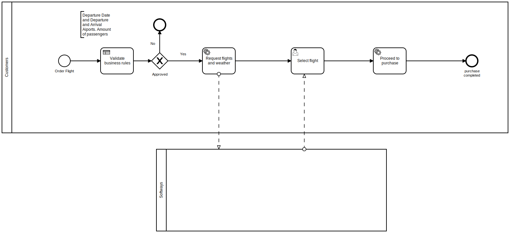
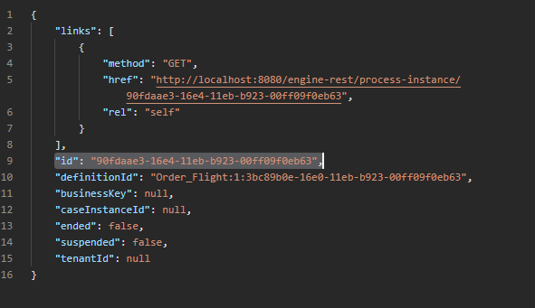
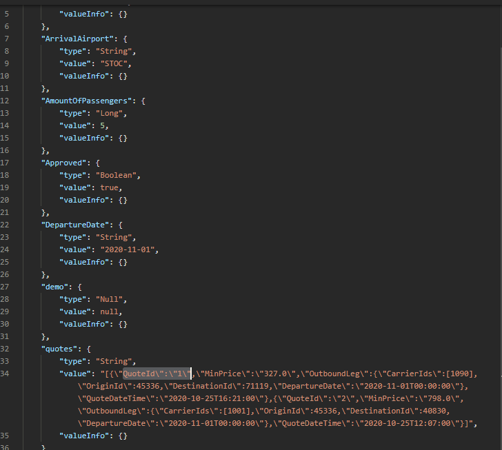
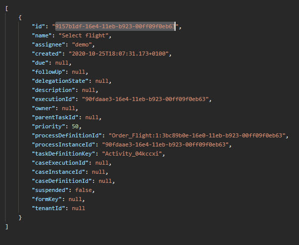
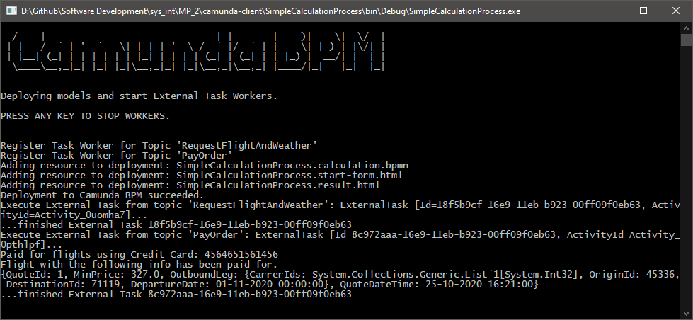

# System Integration Mini Project BPMN
## Authors 🦍🦧🐒
Adam Saidane - cph-as410@cphbusiness.dk  
Emil Valbak Hermansen - cph-eh108@cphbusiness.dk  
Sebastian Lundsgaard-Larsen - cph-281@cphbusiness.dk  
## Project description 📕
We are creating a service which sells flights and shows the weather information of the travel destination.  
The following BPMN diagram shows a user who searches for a flight. We have a business rule stating that only 9 or fewer passengers can be in an order.  
If the business rules are validated, our backend will contact two external APIs to get information of available flights and weather information. Once the information has been received on the backend, it will be forwarded to the client, who can then select a flight and purchase their order.

  
## Setting up the project 👻
1. Register and apply for an API key for Skyscanner here: https://rapidapi.com/skyscanner/api/skyscanner-flight-search  
2. Enter your API key in the [GetFlightsAndWeather.cs file](./camunda-client/SimpleCalculationProcess/GetFlightsAndWeather.cs)  
It should only take a couple of minutes.
2. Start your Camunda server
3. Open Camunda modeler and deploy [the business rules](./busrules.dmn) and the [BPMN model.](./order_flight.bpmn)
4. Start the CamundaClient application by running the `Program.cs` file
## Demoing the project 🐱‍👤
For these steps we recommend using an API client such as [Postman.](https://www.postman.com)
1. Start a new process by making a **POST** request to the following URL:   
url: `http://localhost:8080/engine-rest/process-definition/key/Order_Flight/start`  
body:  
```json
{
  "variables": {
    "DepartureAirport": {"value":"COPE","type":"String"},
    "ArrivalAirport":{"value":"STOC","type":"String"},
    "DepartureDate":{"value":"2020-11-01","type":"String"},
    "AmountOfPassengers":{"value":5,"type":"Long"}
  }
}
```  
2. Grab the "id" from the response body and use it in the next request.  
  
<em>Copy and paste the value from the id field from the response body.</em>
3. Make a GET request to the following url to see the available variable:   
   Url: `http://localhost:8080/engine-rest/process-instance/YOUR_PROCESS_ID/variables`
    Grab a quoteId from the Quotes object and save it.
      
<em>Copy and paste the value from a QuoteId field from the response body.</em>  
**If you are using Windows and the "quotes" object does not show up, the console from the C# application has been frozen. Just type in a random letter in the console and it should continue running.**

4. Make a GET request to the following URL:  
GET `http://localhost:8080/engine-rest/task?processInstanceId=YOUR_PROCESS_ID`  
From the first (and only) result in the list grab the task `id` attribute and use it for the next request.  
  
<em>Copy and paste the value from the id field from the response body.</em>
5. Make a POST request with the following URL and body:  
POST `http://localhost:8080/engine-rest/task/YOUR_TASK_ID/complete`
body:  
```json
{
    "variables":
    {
        "SelectedFlight": {"value": 1}, 
        "CardNumber": {"value": 4564651561456}
    }
}
```  
Your console should now look something like this:  
  
You have now selected and paid for a flight, thank you for using our service 😎

